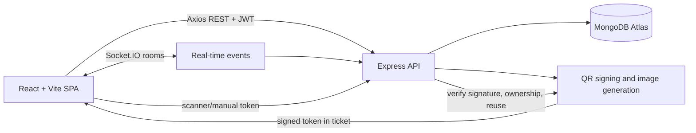

# EventHub

EventHub is a full-stack event management platform for discovering events, publishing venue seating charts, booking tickets, generating QR tickets, and checking attendees in at the door.

## Live Demo

Deployments are configured for Vercel (client) and Render (server). Replace these placeholders after deployment:

- Frontend: `https://your-app.vercel.app`
- Backend API: `https://your-api.onrender.com/api`
- Demo organizer: `organizer@eventhub.local` / `Organizer123!`
- Demo attendee: `attendee@eventhub.local` / `Attendee123!`

The demo accounts are intended for development and review environments. Rotate credentials before using a public production deployment.

## Tech Stack

| Area | Technologies |
| --- | --- |
| Frontend | React, Vite, Tailwind CSS, React Router, Axios |
| State and data | Zustand, TanStack React Query |
| Backend | Node.js, Express, Mongoose |
| Database | MongoDB Atlas |
| Real time | Socket.IO |
| Security and tickets | JWT, bcryptjs, signed QR tokens, qrcode |
| Testing | Jest, Supertest, MongoDB Memory Server |
| Deployment | Vercel frontend, Render backend |

## Features

- Attendee and organizer registration/login with JWT authentication.
- Role-protected organizer and attendee portals.
- Event creation, editing, publishing, filtering, and discovery.
- Tiered INR pricing and a 260-seat seating-chart limit.
- Premium/VIP-first generated seating layouts.
- Live seat holds, expiry, booking, release, and multi-seat selection.
- Transaction-safe bookings and mock payment references.
- Individual QR tickets with sharing and lazy re-display.
- My Tickets portal with upcoming and past/cancelled bookings.
- Cancellation with simulated refunds, a 24-hour cutoff, and live seat release.
- Organizer roster, CSV export, revenue analytics, and announcements.
- Camera/manual QR check-in with tamper and reuse protection.
- Live announcements, seat availability, and check-in counts through Socket.IO.
- Responsive attendee and organizer navigation for mobile and desktop.

## Architecture



The frontend uses REST for durable data and Socket.IO event rooms for seat holds, bookings, releases, announcements, and check-in updates. MongoDB stores users, events, seats, bookings, tickets, and announcements. QR tokens contain the booking and seat identifiers and are signed with `QR_SECRET`.

## Local Setup

### Backend

```bash
cd server
npm install
copy .env.example .env
```

Fill in `MONGO_URI`, `JWT_SECRET`, and `QR_SECRET` in `server/.env`. Keep `JWT_SECRET` and `QR_SECRET` different. For local development, `CLIENT_URL=http://localhost:5173` is correct.

Start the backend:

```bash
npm run dev
```

The API runs at `http://localhost:5000`. Verify it with `http://localhost:5000/api/health`.

### Frontend

```bash
cd client
npm install
copy .env.example .env
npm run dev
```

The frontend runs at the Vite URL shown in the terminal, normally `http://localhost:5173`.

### Demo seed

With the backend `.env` configured and MongoDB reachable:

```bash
cd server
npm run seed
```

The seed is idempotent for the demo users and named events. It creates:

- Organizer: `organizer@eventhub.local` / `Organizer123!`
- Attendee: `attendee@eventhub.local` / `Attendee123!`
- Future Builders Summit
- Sunset Live Sessions

## Production Deployment

### Render backend

1. Create a Render Web Service from this repository.
2. Set the root directory to `server`.
3. Build command: `npm install`.
4. Start command: `npm start`.
5. Configure:
   - `MONGO_URI`
   - `JWT_SECRET`
   - `QR_SECRET`
   - `CLIENT_URL=https://your-app.vercel.app`
   - `PORT=5000`
6. Allow the Render service to reach MongoDB Atlas. For a development/demo deployment, Atlas `0.0.0.0/0` is the simplest option.
7. Verify `/api/health` before connecting the frontend.

### Vercel frontend

1. Import the repository into Vercel.
2. Set the root directory to `client`.
3. Framework: Vite.
4. Build command: `npm run build`.
5. Output directory: `dist`.
6. Configure:
   - `VITE_API_URL=https://your-api.onrender.com/api`
   - `VITE_SOCKET_URL=https://your-api.onrender.com`

Render's free tier may sleep when inactive, so the first request can have a cold-start delay.

## Data Model

- **Users** store the attendee or organizer name, normalized email, bcrypt password hash, and role.
- **Events** belong to an organizer and store title, description, category, venue, date, capacity, publication status, and embedded price tiers.
- **Seats** belong to an event and store row/label, tier, price, status, hold owner, and hold expiry. Seat labels are unique within an event.
- **Bookings** connect one attendee to one event and multiple seats, storing amount, payment reference, confirmation/cancellation status, and simulated refund reference.
- **Tickets** connect a booking to one seat and store the signed QR token plus check-in state and timestamp.
- **Announcements** connect an organizer and event to a message and timestamps; the message is persisted and emitted to the event's Socket.IO room.

## Testing

Run the isolated API suites against MongoDB Memory Server:

```bash
cd server
npm test
npx jest --coverage --runInBand
```

The tests cover registration, login, role guards, atomic holds, booking success/failure, QR generation, QR tampering, and ticket reuse.

## Known Limitations

- Payment is mocked; no real payment processor is integrated.
- Render free-tier services can cold-start after inactivity.
- QR camera access requires browser permission and a secure origin in production.
- Atlas network access must permit the deployed Render service.
