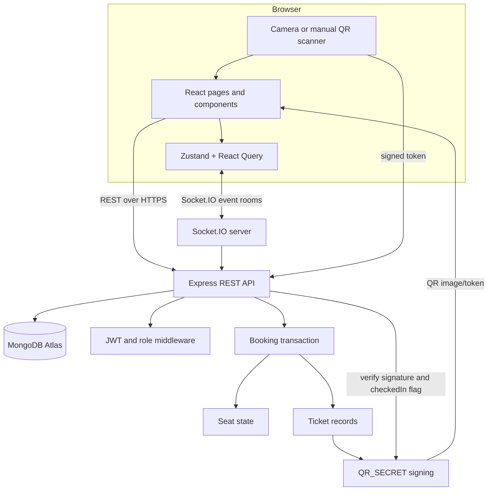

# EventHub architecture diagram

## Main real-time events

- `seat-updated`: hold and release changes.
- `seats-booked`: seats committed by a booking transaction.
- `seats-released`: seats freed by an eligible cancellation.
- `announcement`: organizer messages for an event room.
- `checkin-update`: live checked-in count for dashboards and scanner pages.
